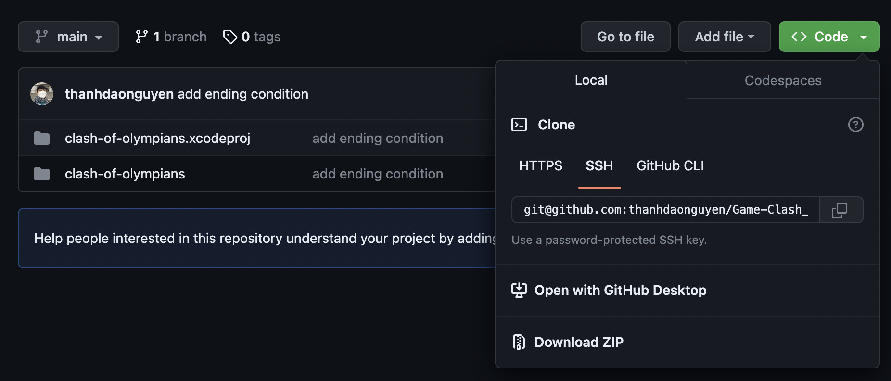

# CLASH OF OLYMPIANS

Become a demigod and keep the horde of heathens away from your temple!

## Features

### Game mechanics

- Tower defense

### Levels

1 infinite level

### Characters 

Update later

## Install and Run the game

### 1. Mac OS

Step 1: Install SDL 2.0 according to this [link](https://www.libsdl.org/)

Step 2: Open `Code` tab and download the zip file of the project 

Step 3: Extract the zip file

Step 4: Open Terminal, then go to the folder where this README file is stored and run these commands:

`cd clash-of-olympians`

`sh buildMac.sh`

`./bin/prog`

### 2. Windows or Ubuntu

Update later

## Game rules

Try to protect your temple by throw your weapon to the enemy. You will aim your shot by holding the mousebutton and release it to fire. If your weapons hit the enemy, they will die and disappear. If you let the enemies close to your temple, they will do damage to your temple and you will see the HP decrease. If you let HP down to 0, you lose!

## Development

Update later 

## Credits

thanhdaonguyen

## License

Free to everyone

## Contact

22028113@vnu.edu.vn
